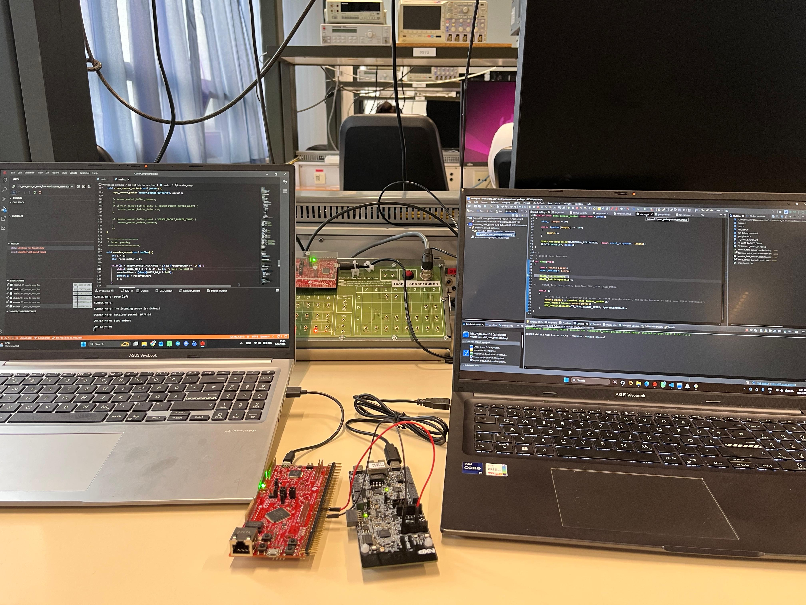

# TM4C1294 and FRDM-RW612 Processor-to-Processor UART Communication

A C cross-platform communication project demonstrating a dual-processor architecture. This project interfaces an NXP FRDM-RW612 (simulating an intensive sensor collection and preprocessing node) with a Texas Instruments Tiva C TM4C1294NCPDT (acting as the central navigation unit) via an asynchronous serial link to steer a Finite State Machine (FSM).

---

## Features
* Dual-Processor System Topology: Distributes processing load by offloading high-frequency sensor capture to a dedicated NXP board while reserving the TI processor for motor control logic.
* Interrupt-Free State Machine: Features a localized control Finite State Machine (FSM) on the TM4C1294 that cycles dynamically depending on real-time sensor evaluations.
* Multi-Stage Validation Pipeline: Implements strict string parsing and prefix validation routines to defend the control logic against serial data corruption or incomplete packets.
* Hardware-Based Timeouts: Reuses a 32-bit standalone periodic configuration on Timer 1A to drive highly accurate microsecond and millisecond system block delays.

---

## Hardware Requirements
* Central Navigation Board: Tiva C Series TM4C1294NCPDT (EK-TM4C1294XL LaunchPad)
* Sensor Simulation Board: NXP FRDM-RW612
* Physical Interconnects:
  * NXP FLEXCOMM3/USART3 TXD (GPIO_26) $\rightarrow$ TI UART6 RX (Pin PP0)
  * NXP FLEXCOMM3/USART3 RXD (GPIO_24) $\leftarrow$ TI UART6 TX (Pin PP1) [Optional for bidirectional handshaking]
  * Reference Ground: Common GND link between both evaluation platforms.

---

## Physical System Integration
	

---

## How It Works

### 1. Transmitter Configuration (NXP FRDM-RW612 side)
* Periodically generates formatted telemetry string payloads representing active threat zones (`"DATA:80\r\n"`, `"DATA:35\r\n"`, `"DATA:10\r\n"`, or `"INVALID\r\n"`).
* Packages and pipes the raw array string over the wire using blocking driver calls (`USART_WriteBlocking`) mapped to a standard 8N1 frame format running at 9600 baud.

### 2. Receiver and Pin Configuration (TI TM4C1294 side)
* Activates the clock gating parameters for Port P via `SYSCTL_RCGCGPIO_R` and sets alternate function capabilities (`GPIO_PORTP_AFSEL_R`) on pins PP0 and PP1.
* Maps routing lanes specifically to the local UART6 peripheral macro block using port control nibbles (`GPIO_PORTP_PCTL_R` fields set to `0x11`).
* Allocates standard 9600 baud parameters using an Integer Baud-Rate Divisor (IBRD) of 104 and a Fractional Baud-Rate Divisor (FBRD) of 11.

### 3. Finite State Machine Logic
The main system execution context on the TM4C1294 unrolls sequentially inside a structured state matrix:

* **STATE_WAIT_FOR_DATA:** Polls the hardware Receive FIFO status bits. It sequentially reads bytes out of `UART6_DR_R` until encountering a newline (`\n`) delimiter, null-terminates the resulting array, and stores it into local tracking buffers.
* **STATE_PARSE_DATA:** Validates that the array complies with the `"DATA:XX\r\n"` packet signature. If verified, it parses the numeric ASCII slice using `atoi` and transitions forward; malformed lines trigger a jump to `STATE_ERROR`.
* **STATE_DECIDE_ACTION:** Evaluates the extracted integer distance value and maps it to target behavior profiles:
  * $41 \text{ to } 100\text{ cm}$: Sets navigation variable to `MOVE_FORWARD`.
  * $16 \text{ to } 40\text{ cm}$: Sets navigation variable to `MOVE_LEFT` to avoid an obstacle.
  * $0 \text{ to } 15\text{ cm}$: Sets navigation variable to `MOVE_STOP` due to close proximity.
* **STATE_EXECUTE_ACTION:** Invokes the corresponding physical motor driver blueprints based on the evaluated movement type and safely routes the FSM context back to wait for the next telemetry stream packet.

---

## Collaborators
* [lcarricart](https://github.com/lcarricart) - Project Contributor